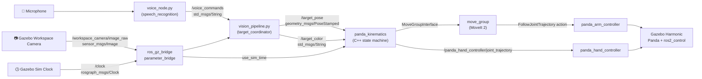

# 🦾 Franka Panda — Voice-Controlled Vision Pick & Place

**ROS 2 · Gazebo Harmonic · MoveIt 2 · OpenCV**

[](https://docs.ros.org/)
[](https://gazebosim.org/)
[](https://moveit.ros.org/)
[](https://opencv.org/)
[](https://isocpp.org/)
[](https://www.python.org/)
[](https://www.youtube.com/watch?v=6uoRUwFMX70)

A full-stack ROS 2 manipulation pipeline for the **Franka Emika Panda** arm that fuses **speech recognition**, **markerless computer vision**, and a **dynamic MoveIt 2 state machine** to pick up colored blocks on spoken command and sort them into color-coded drop-off zones — entirely in a Gazebo Harmonic simulation.

> Say *"pick up the blue block"* → the robot finds it, picks it up, and places it in the correct zone. No markers, no depth camera, no manual coordinates.

---

## 📋 Table of Contents

1. [Demo Video](#-demo-video)
2. [Project Overview](#-project-overview)
3. [Key Features](#-key-features)
4. [System Architecture](#️-system-architecture)
5. [ROS 2 Nodes](#-ros-2-nodes)
6. [Topics & Interfaces](#-topics--interfaces)
7. [Robust Callback & Concurrency Design](#-robust-callback--concurrency-design)
8. [Simulation Time Synchronization](#-simulation-time-synchronization)
9. [Repository Structure](#-repository-structure)
10. [Installation & Prerequisites](#-installation--prerequisites)
11. [Detailed Execution Guide (Linux)](#-detailed-execution-guide-linux)
12. [Issuing Voice Commands](#️-issuing-voice-commands)
13. [Screenshots](#-screenshots)
14. [Roadmap](#-roadmap)
15. [Author](#-author)

---

## 🎥 Demo Video

<p align="center">
  <a href="https://www.youtube.com/watch?v=6uoRUwFMX70">
    
  </a>
</p>

<p align="center">
  <a href="https://www.youtube.com/watch?v=6uoRUwFMX70"><strong>▶ Watch the full demo on YouTube</strong></a>
</p>

The video shows the complete loop end-to-end: a spoken color command, live OpenCV target detection, MoveIt 2 planning the approach, and the Panda arm sorting the block into its drop-off zone in Gazebo.

---

## 🎬 Project Overview

The system listens for voice commands (e.g. *"Pick up the green block"*). Once an intent is recognized, a top-down RGB camera pipeline calculates the absolute 3D world coordinates of the target object using 2D-to-3D mathematical projection — no depth sensor or fiducial markers required. A custom C++ MoveIt 2 state machine then takes over, dynamically routing the robot to hover, grasp, lift, and sort the object into a designated drop-off zone based on its color, while staying perfectly synchronized with the Gazebo simulation clock.

---

## ✨ Key Features

* **🗣️ Semantic Target Acquisition** — Regex-based natural language parsing (`pick up | pick | grab | target | get` + color) extracts actionable intent from raw speech transcripts, without a heavyweight NLP stack.
* **👁️ Markerless 3D Vision** — An OpenCV pipeline that performs HSV color masking and contour detection, then projects 2D pixel coordinates `(u, v)` into absolute 3D world coordinates `(X, Y, Z)` using known camera intrinsics — no depth camera or point cloud needed.
* **🦾 Dynamic MoveIt 2 State Machine** — A C++ node driving a six-stage Hover → Descend → Grasp → Lift → Translate → Release sequence, with IK solving, planning, and orthogonal grasp alignment handled through `MoveGroupInterface`.
* **🔀 Robust, Non-Blocking Callback Design** — Dedicated `MutuallyExclusive` callback groups on a `MultiThreadedExecutor` keep perception updates flowing *while* the arm is mid-motion, so Gazebo interaction never stalls (see [below](#-robust-callback--concurrency-design)).
* **⏱️ Simulation-Time Synchronized Execution** — Every timed wait, trajectory stamp, and gripper actuation is pinned to Gazebo's simulated clock rather than the wall clock, eliminating drift between planned and physically executed motion (see [below](#-simulation-time-synchronization)).
* **🎯 Hardware-Accurate Actuation** — Compensates for the physical 45° wrist offset of the Franka Panda flange for a perfectly orthogonal, parallel-jaw grasp, and drives the `panda_hand_controller` directly for near-instant gripper response.
* **🌈 Color-Aware Sorting Logic** — The kinematics node dynamically routes each block to its own drop-off coordinate (left / center / right) based on the color reported by the vision pipeline, updated live via its own callback.

---

## 🏗️ System Architecture



1. **Vision & Perception** (`vision_pipeline.py`) — Subscribes to the bridged Gazebo camera topic, applies HSV masking and contour detection, projects 2D pixels into 3D world coordinates using known camera intrinsics and workspace constraints, and publishes the target `PoseStamped` and color string.
2. **Kinematics & Control** (`panda_kinematics.cpp`) — Subscribes to the target pose and color topics, plans Cartesian trajectories with `MoveGroupInterface`, actuates `panda_hand_controller` via `JointTrajectory` messages, and executes the six-step pick-and-place state machine.
3. **Simulation & TF2 Framework** — A fully configured URDF/Xacro model of the Panda spawned into a custom Gazebo Harmonic world, with `ros2_control` managing the arm and gripper controllers, and a synchronized `/clock` bridge preventing trajectory execution drift between MoveIt's planner and Gazebo's physics engine.

---

## 🧩 ROS 2 Nodes

| Node | Source | Language | Responsibility |
|---|---|---|---|
| `voice_node` | `scripts/voice_node.py` | Python | Captures microphone audio on a background thread, transcribes it via Google Speech Recognition, and publishes the raw text. |
| `target_coordinator` | `scripts/vision_pipeline.py` | Python | Parses intent from the transcript, runs the OpenCV color-detection pipeline, and computes/publishes 3D target coordinates. |
| `panda_kinematics` | `src/panda_kinematics.cpp` | C++ | Runs the MoveIt 2 pick-and-place state machine with parallel, non-blocking callback groups and sim-time-synchronized actuation. |
| `grasping_logic` | `src/grasping_logic.cpp` | C++ | Lightweight scaffold executable reserved for extending standalone grasp-planning logic. |

---

## 🔌 Topics & Interfaces

| Topic | Message Type | Publisher(s) | Subscriber(s) | Purpose |
|---|---|---|---|---|
| `/voice_commands` | `std_msgs/String` | `voice_node` | `target_coordinator` | Raw transcribed speech text. |
| `/workspace_camera/image_raw` | `sensor_msgs/Image` | Gazebo camera sensor (via `ros_gz_bridge`) | `target_coordinator` | Top-down RGB feed of the workspace. |
| `/target_pose` | `geometry_msgs/PoseStamped` | `target_coordinator` | `panda_kinematics` | Computed 3D world coordinate of the detected block. |
| `/target_color` | `std_msgs/String` | `target_coordinator` | `panda_kinematics` | Active target color, used for sorting. |
| `/panda_hand_controller/joint_trajectory` | `trajectory_msgs/JointTrajectory` | `panda_kinematics` | `panda_hand_controller` (`ros2_control`) | Gripper open/close commands. |
| `/clock` | `rosgraph_msgs/Clock` | Gazebo (via `ros_gz_bridge`) | All nodes running with `use_sim_time: true` | Simulation time source for clock synchronization. |
| `/joint_states` | `sensor_msgs/JointState` | `joint_state_broadcaster` | `move_group`, RViz, TF | Live joint state feedback. |

The Panda arm itself is driven through the `panda_arm_controller`'s `FollowJointTrajectory` **action** interface, invoked internally by `MoveGroupInterface` rather than a raw topic.

---

## 🔀 Robust Callback & Concurrency Design

Reliable Gazebo interaction hinges on the ROS 2 node never blocking while a long-running motion is executing. `panda_kinematics.cpp` addresses this with an explicit concurrency model:

* **Separate `MutuallyExclusive` callback groups** are created for the pose subscriber and the color subscriber, so the two callbacks can never deadlock each other but also never contend for the same execution slot.
* A **`MultiThreadedExecutor`** spins both groups in parallel threads. This means that while `pose_callback()` is blocked inside a long, physically-executing `move_group_->move()` call, the color subscriber's lambda callback can still fire instantly and update `current_color_` in real time.
* The result is a **robust, non-blocking interaction model with Gazebo**: perception data is never queued up or dropped just because the arm is mid-motion, and the color used for the final sorting step is always the freshest value received — even mid-sequence.
* Two callback idioms are used side by side by design: a bound member function (`pose_callback`) for the primary state-machine trigger, and an inline lambda for the lightweight color update, keeping the hot path for perception updates as short and dependency-free as possible.

---

## ⏱️ Simulation Time Synchronization

Because MoveIt 2's planner and Gazebo's physics engine run on independent update loops, the project pins every time-sensitive operation to the **simulated** clock instead of the wall clock:

* `use_sim_time: true` is set on every node (`robot_state_publisher`, `move_group`, `panda_kinematics`) via launch parameters, so `this->get_clock()->now()` returns simulation time throughout the stack.
* `ros_gz_bridge`'s `parameter_bridge` bridges Gazebo's `/clock` topic into the ROS 2 graph, giving every node a shared, authoritative notion of "now."
* A dedicated **`wait_for_sim_time()`** helper replaces wall-clock sleeps with a lightweight polling loop that checks the *simulation* clock, so gripper grasp/release holds stay correctly timed even if Gazebo's real-time factor speeds up or throttles down.
* Outgoing `JointTrajectory` messages stamp `header.stamp` using the synchronized sim clock, so gripper actuation timing lines up deterministically with the physics step Gazebo is currently executing — preventing the trajectory execution drift that would otherwise creep in between MoveIt's planned timing and Gazebo's simulated timing.

---

## 📁 Repository Structure

```
Franka-cv-voice-pipeline/
├── README.md
└── my_panda_project/                  # ROS 2 package (ament_cmake)
    ├── CMakeLists.txt
    ├── package.xml
    ├── config/
    │   └── ros2_controllers.yaml       # joint_state_broadcaster, arm & hand controllers
    ├── launch/
    │   ├── spawn_panda.launch.py       # Gazebo + robot spawn + controllers
    │   └── kinematics.launch.py        # move_group + panda_kinematics
    ├── scripts/
    │   ├── voice_node.py               # Speech-to-text intent capture
    │   └── vision_pipeline.py          # OpenCV vision + 2D→3D projection
    ├── src/
    │   ├── panda_kinematics.cpp        # MoveIt 2 pick-and-place state machine
    │   └── grasping_logic.cpp          # Reserved grasp-logic scaffold
    ├── urdf/
    │   ├── panda_sim.urdf.xacro        # Simulation robot description
    │   └── clean_panda.urdf
    └── worlds/
        └── workspace.sdf               # Gazebo world + workspace camera
```

---

## 🚀 Installation & Prerequisites

| Component | Notes |
|---|---|
| **Ubuntu 22.04 / 24.04** | Matches the target ROS 2 distro below. |
| **ROS 2** (Humble or Jazzy) | Core middleware. |
| **Gazebo Harmonic** | Simulation environment (`ros_gz_sim`, `ros_gz_bridge`). |
| **MoveIt 2** | Motion planning (`moveit_ros_planning_interface`, `moveit_visual_tools`). |
| **OpenCV + `cv_bridge`** | Vision pipeline. |
| **`SpeechRecognition` + PyAudio** | `pip install SpeechRecognition pyaudio` (also needs `portaudio19-dev` on the system, and an internet connection for the Google Speech API used by `voice_node.py`). |

### Build Instructions

```bash
mkdir -p ~/panda_manipulation_ws/src
cd ~/panda_manipulation_ws/src
git clone https://github.com/PaONEkaruchola/Franka-cv-voice-pipeline.git

cd ~/panda_manipulation_ws
rosdep install --from-paths src --ignore-src -r -y
colcon build --packages-select my_panda_project
source install/setup.bash
```

---

## 🐧 Detailed Execution Guide (Linux)

Running the full stack takes several terminals working together. Using a terminal multiplexer such as `tmux` or Terminator is strongly recommended.

**Source the workspace in every new terminal before running anything:**

```bash
cd ~/panda_manipulation_ws
source install/setup.bash
```

### Terminal 1 — Launch the Simulation Environment

Boots Gazebo Harmonic, spawns the Franka Panda URDF, and starts `controller_manager` to load the `panda_arm_controller` and `panda_hand_controller`.

```bash
ros2 launch my_panda_project spawn_panda.launch.py
```

### Terminal 2 — Synchronize the ROS 2 ↔ Gazebo Bridges

Bridges Gazebo's simulation clock into ROS 2 (so MoveIt's planner never drifts from Gazebo's physics), and bridges the workspace camera feed into the OpenCV pipeline.

```bash
ros2 run ros_gz_bridge parameter_bridge \
  /clock@rosgraph_msgs/msg/Clock[gz.msgs.Clock \
  /workspace_camera/image_raw@sensor_msgs/msg/Image[gz.msgs.Image
```

### Terminal 3 — Start the Vision Pipeline

Boots the OpenCV node responsible for color detection and 3D coordinate projection.

```bash
ros2 run my_panda_project vision_pipeline.py
```

An OpenCV window will pop up showing the live top-down feed of the workspace.

### Terminal 4 — Start the Voice Intent Parser

Boots the microphone listener and speech-to-intent node.

```bash
ros2 run my_panda_project voice_node.py
```

### Terminal 5 — Launch MoveIt 2 and the Kinematics State Machine

Starts the official MoveIt 2 `move_group` planning backend alongside the custom C++ state machine, which initializes its parallel callback groups, subscribes to the vision topics, and waits for coordinates.

```bash
ros2 launch my_panda_project kinematics.launch.py
```

---

## 🎙️ Issuing Voice Commands

Once all five terminals are running, speak (or type, into the microphone) a command such as:

* *"Pick up the red block."*
* *"Target the blue block."*
* *"Grab the green object."*

### Execution Flow

1. The regex-based intent parser in `vision_pipeline.py` identifies the color and confirms a valid pick intent.
2. The vision pipeline isolates the matching block via HSV masking, computes its `[X, Y, Z]` world coordinates, and publishes them on `/target_pose` and `/target_color`.
3. `panda_kinematics` receives the pose on its own callback group, updates its internal target color live from the parallel color callback, and runs the six-step pick-and-place state machine.
4. The arm performs an orthogonal, parallel-jaw grasp on the block, lifts it, and routes it to the drop-off coordinate (left, center, or right) assigned to its color.

---

## 🖼️ Screenshots

<p align="center">
  
</p>

---

## 🗺️ Roadmap

* [ ] Flesh out `grasping_logic.cpp` into a standalone, reusable grasp-planning module.
* [ ] Replace the cloud-dependent Google Speech API with an offline recognizer for fully self-contained operation.
* [ ] Add automated integration tests for the vision → kinematics coordinate pipeline.
* [ ] Package a single top-level launch file that brings up all five terminals' worth of nodes together.

---

## 👤 Author

**Pavan Karuchola**
[GitHub @PaONEkaruchola](https://github.com/PaONEkaruchola)

Contributions, issues, and feature suggestions are welcome — feel free to open an issue or pull request.
