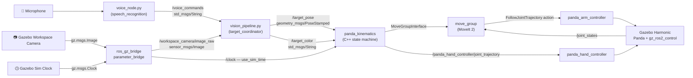

# 🦾 Franka Panda — Voice-Controlled Vision Pick & Place

**ROS 2 Jazzy · Gazebo Harmonic · MoveIt 2 · OpenCV**

[](https://docs.ros.org/en/jazzy/)
[](https://gazebosim.org/)
[](https://moveit.ros.org/)
[](https://control.ros.org/jazzy/doc/gz_ros2_control/doc/index.html)
[](https://opencv.org/)
[](https://isocpp.org/)
[](https://www.python.org/)
[](https://www.youtube.com/watch?v=6uoRUwFMX70)

A full-stack ROS 2 manipulation pipeline for the **Franka Emika Panda** arm that fuses **speech recognition**, **markerless computer vision**, and a **dynamic MoveIt 2 state machine** to pick up colored blocks on spoken command and sort them into color-coded drop-off zones — running against a real physics simulation in Gazebo Harmonic, not fake controllers.

> Say *"pick up the blue block"* → the robot finds it, picks it up, and places it in the correct zone. No markers, no depth camera, no hard-coded coordinates.

---

## 📋 Table of Contents

1. [Demo Video](#-demo-video)
2. [Project Overview](#-project-overview)
3. [Project Scope — What This Repository Contains](#-project-scope--what-this-repository-contains)
4. [Key Features](#-key-features)
5. [System Architecture](#️-system-architecture)
6. [ROS 2 Nodes](#-ros-2-nodes)
7. [Topics & Interfaces](#-topics--interfaces)
8. [Robust Callback & Concurrency Design](#-robust-callback--concurrency-design)
9. [Simulation Time Synchronization](#️-simulation-time-synchronization)
10. [Installation](#-installation)
11. [Workspace Layout & Build](#️-workspace-layout--build)
12. [Detailed Execution Guide (Linux)](#-detailed-execution-guide-linux)
13. [Issuing Voice Commands](#️-issuing-voice-commands)
14. [Troubleshooting](#-troubleshooting)
15. [Screenshots](#️-screenshots)
16. [Development Roadmap](#️-development-roadmap)
17. [Author](#-author)

---

## 🎥 Demo Video

<p align="center">
  <a href="https://www.youtube.com/watch?v=6uoRUwFMX70">
    
  </a>
</p>

<p align="center">
  <a href="https://www.youtube.com/watch?v=6uoRUwFMX70"><strong>▶ Watch the full demo on YouTube</strong></a>
</p>

The video shows the complete loop end-to-end: a spoken color command, live OpenCV target detection, MoveIt 2 planning the approach, and the Panda arm sorting the block into its drop-off zone in Gazebo.

---

## 🎬 Project Overview

The system listens for voice commands (e.g. *"Pick up the green block"*). Once an intent is recognized, a top-down RGB camera pipeline calculates the absolute 3D world coordinates of the target object using 2D-to-3D mathematical projection — no depth sensor or fiducial markers required. A custom C++ MoveIt 2 state machine then takes over, dynamically routing the robot to hover, grasp, lift, and sort the object into a designated drop-off zone based on its color, while staying synchronized with the Gazebo simulation clock throughout.

Unlike a MoveIt demo running on fake controllers, this stack plans against a live physics engine: `gz_ros2_control` exposes the Panda's joints as real `ros2_control` hardware interfaces inside Gazebo Harmonic, so every trajectory MoveIt produces is actually executed by simulated actuators with collision dynamics.

---

## 📦 Project Scope — What This Repository Contains

This repository holds **the pipeline and simulation integration I wrote**, not a vendored copy of the Franka robot model. The robot description and MoveIt configuration are pulled in as standard upstream ROS 2 packages at install time rather than committed here — this keeps the repository small, avoids duplicating maintained upstream assets, and means the project always builds against the current release of the Panda resources.

**Authored in this repository**

| Component | File |
|---|---|
| Voice intent capture node | `scripts/voice_node.py` |
| OpenCV perception & 2D→3D projection node | `scripts/vision_pipeline.py` |
| MoveIt 2 pick-and-place state machine | `src/panda_kinematics.cpp` |
| Gazebo world with the top-down workspace camera | `worlds/workspace.sdf` |
| Simulation spawn & controller bring-up launch | `launch/spawn_panda.launch.py` |
| MoveIt + kinematics bring-up launch | `launch/kinematics.launch.py` |
| `ros2_control` controller configuration | `config/ros2_controllers.yaml` |
| Simulation robot description wrapper | `urdf/panda_sim.urdf.xacro` |

**Consumed from upstream (installed via `apt`, see [Installation](#-installation))**

| Upstream asset | Provided by |
|---|---|
| Panda URDF / meshes / joint limits | `moveit_resources_panda_description` |
| Panda SRDF, kinematics & planning config | `moveit_resources_panda_moveit_config` |
| Motion planning framework | `moveit` (MoveIt 2) |
| Gazebo ↔ ROS 2 simulation & bridging | `ros_gz_sim`, `ros_gz_bridge` |
| Gazebo hardware interface for `ros2_control` | `gz_ros2_control` |

> **Note on repository completeness.** This is an actively developed portfolio project. Some large simulation assets and in-progress nodes are not yet tracked here due to upload size limits, and are being added incrementally — see the [Development Roadmap](#️-development-roadmap). Everything documented in the execution guide below runs with the dependency set listed in [Installation](#-installation).

---

## ✨ Key Features

* **🗣️ Semantic Target Acquisition** — Regex-based natural language parsing (`pick up | pick | grab | target | get` + color) extracts actionable intent from raw speech transcripts, without a heavyweight NLP stack. Commands naming a color but carrying no valid action verb are correctly rejected rather than misfired.
* **👁️ Markerless 3D Vision** — An OpenCV pipeline that performs HSV color masking and contour detection, then projects 2D pixel coordinates `(u, v)` into absolute 3D world coordinates `(X, Y, Z)` from known camera intrinsics and workspace geometry — no depth camera or point cloud needed. Red is masked across both hue wrap-around ranges so it detects reliably at the HSV boundary.
* **🔒 Single-Shot Target Latching** — The vision node clears its active target the instant a pose is published, so a continuous 30 FPS camera stream produces exactly **one** goal per spoken command instead of flooding MoveIt with hundreds of duplicate planning requests.
* **🦾 Dynamic MoveIt 2 State Machine** — A C++ node driving a six-stage Hover → Descend → Grasp → Lift → Translate → Release sequence, with IK solving, planning, and orthogonal grasp alignment handled through `MoveGroupInterface`. Every stage is plan-checked, and a planning failure aborts the sequence cleanly instead of executing a partial motion.
* **🔀 Robust, Non-Blocking Callback Design** — Dedicated `MutuallyExclusive` callback groups on a `MultiThreadedExecutor` keep perception updates flowing *while* the arm is mid-motion, so Gazebo interaction never stalls or deadlocks ([details](#-robust-callback--concurrency-design)).
* **⏱️ Simulation-Time Synchronized Execution** — Every timed wait, trajectory stamp, and gripper actuation is pinned to Gazebo's simulated clock rather than the wall clock, eliminating drift between planned and physically executed motion ([details](#️-simulation-time-synchronization)).
* **🧱 Single-Source Robot Description** — One URDF/Xacro drives Gazebo, TF, and MoveIt alike; `ros_gz_sim` converts it to SDF at spawn time, and preset joint angles place the arm in MoveIt's `ready` pose from the very first physics step, so the model is statically stable immediately and never needs a settling period ([details](#robot-description-urdf--sdf-conversion--spawn-pose)).
* **🎯 Hardware-Accurate Actuation** — Compensates for the physical 45° wrist offset of the Franka Panda flange for a perfectly orthogonal, parallel-jaw grasp, and commands the `panda_hand_controller` directly for near-instant gripper response.
* **🌈 Color-Aware Sorting Logic** — The kinematics node routes each block to its own drop-off coordinate (left / center / right) based on the color reported by the vision pipeline, resolved live at the moment the sorting stage is reached.

---

## 🏗️ System Architecture



1. **Vision & Perception** (`vision_pipeline.py`) — Subscribes to the bridged Gazebo camera topic, applies HSV masking and contour detection, projects 2D pixels into 3D world coordinates using known camera intrinsics and workspace constraints, and publishes the target `PoseStamped` and color string.
2. **Kinematics & Control** (`panda_kinematics.cpp`) — Subscribes to the target pose and color topics, plans trajectories with `MoveGroupInterface`, actuates `panda_hand_controller` via `JointTrajectory` messages, and executes the six-step pick-and-place state machine.
3. **Simulation & TF2 Framework** — A URDF/Xacro model of the Panda spawned into a custom Gazebo Harmonic world, with `gz_ros2_control` presenting the arm and gripper as `ros2_control` hardware, and a bridged `/clock` topic preventing trajectory execution drift between MoveIt's planner and Gazebo's physics engine.

### Robot Description: URDF → SDF Conversion & Spawn Pose

Gazebo Harmonic simulates SDF, but the robot is authored and maintained as URDF/Xacro — there is no hand-written `.sdf` copy of the arm to keep in sync. The conversion is handled by the launch file itself:

1. `xacro` expands `urdf/panda_sim.urdf.xacro` into a complete URDF at launch time.
2. `robot_state_publisher` publishes that URDF on `/robot_description` and serves the TF tree derived from it.
3. `ros_gz_sim`'s `create` node reads `/robot_description` and **converts the URDF to SDF internally** as it spawns the model into the running world.

A single URDF therefore stays the one source of truth for Gazebo, TF, and MoveIt at once — no duplicated `.sdf` model to drift out of step with the planning description.

#### Deterministic spawn pose

Rather than letting the model drop into the world at all-zero joint angles, the `create` call presets every arm joint with `-J` arguments:

| Joint | 1 | 2 | 3 | 4 | 5 | 6 | 7 |
|---|:--:|:--:|:--:|:--:|:--:|:--:|:--:|
| Angle (rad) | `0.0` | `-0.785` | `0.0` | `-2.356` | `0.0` | `1.57` | `0.785` |

These are the Panda's canonical **`ready`** joint values as defined in the upstream MoveIt configuration, so Gazebo's spawn state and MoveIt's notion of home agree exactly — there is no pose jump or corrective replan the first time the planner takes control.

The practical payoff is stability: because the arm materializes already in a valid, well-conditioned configuration and `panda_arm_controller` holds position from the moment it activates, the model is statically stable from `t = 0`. It does not sag, collapse under gravity, or self-collide while the rest of the stack comes up, which means you can bring up the remaining terminals at your own pace without racing the simulation.

---

## 🧩 ROS 2 Nodes

| Node | Source | Language | Responsibility |
|---|---|---|---|
| `voice_node` | `scripts/voice_node.py` | Python | Captures microphone audio on a background thread, transcribes it via Google Speech Recognition, and publishes the raw text. |
| `target_coordinator` | `scripts/vision_pipeline.py` | Python | Parses intent from the transcript, runs the OpenCV color-detection pipeline, and computes/publishes 3D target coordinates. |
| `panda_kinematics` | `src/panda_kinematics.cpp` | C++ | Runs the MoveIt 2 pick-and-place state machine with parallel, non-blocking callback groups and sim-time-synchronized actuation. |
| `grasping_logic` | `src/grasping_logic.cpp` | C++ | Scaffold executable reserved for the standalone grasp-planning module on the roadmap. |

---

## 🔌 Topics & Interfaces

| Topic | Message Type | Publisher | Subscriber | Purpose |
|---|---|---|---|---|
| `/voice_commands` | `std_msgs/String` | `voice_node` | `target_coordinator` | Raw transcribed speech text. |
| `/workspace_camera/image_raw` | `sensor_msgs/Image` | Gazebo camera sensor (via `ros_gz_bridge`) | `target_coordinator` | Top-down RGB feed of the workspace. |
| `/target_pose` | `geometry_msgs/PoseStamped` | `target_coordinator` | `panda_kinematics` | Computed 3D world coordinate of the detected block. |
| `/target_color` | `std_msgs/String` | `target_coordinator` | `panda_kinematics` | Active target color, used for sorting. |
| `/panda_hand_controller/joint_trajectory` | `trajectory_msgs/JointTrajectory` | `panda_kinematics` | `panda_hand_controller` | Gripper open/close commands. |
| `/clock` | `rosgraph_msgs/Clock` | Gazebo (via `ros_gz_bridge`) | Every node running `use_sim_time: true` | Simulation time source. |
| `/joint_states` | `sensor_msgs/JointState` | `joint_state_broadcaster` | `move_group`, TF, RViz | Live joint state feedback. |
| `/robot_description` | `std_msgs/String` | `robot_state_publisher` | `ros_gz_sim create`, `move_group` | URDF used to spawn and plan for the arm. |

The Panda arm itself is driven through the `panda_arm_controller`'s `FollowJointTrajectory` **action** interface, invoked internally by `MoveGroupInterface` rather than through a raw topic.

**Active controllers** (loaded by `spawn_panda.launch.py`, configured in `config/ros2_controllers.yaml`):

| Controller | Type | Joints |
|---|---|---|
| `joint_state_broadcaster` | `joint_state_broadcaster/JointStateBroadcaster` | all |
| `panda_arm_controller` | `joint_trajectory_controller/JointTrajectoryController` | `panda_joint1` … `panda_joint7` |
| `panda_hand_controller` | `joint_trajectory_controller/JointTrajectoryController` | `panda_finger_joint1` |

---

## 🔀 Robust Callback & Concurrency Design

Reliable Gazebo interaction hinges on the ROS 2 node never blocking while a long-running motion is executing. `panda_kinematics.cpp` addresses this with an explicit concurrency model:

* **Separate `MutuallyExclusive` callback groups** are created for the pose subscriber and the color subscriber, so the two callbacks can never deadlock each other and never contend for the same execution slot.
* A **`MultiThreadedExecutor`** spins both groups in parallel threads. While `pose_callback()` is blocked inside a long, physically-executing `move_group_->move()` call, the color subscriber's lambda callback still fires immediately and updates `current_color_` in real time.
* The result is a **non-blocking interaction model with Gazebo**: perception data is never queued behind a motion or silently dropped just because the arm is mid-trajectory, and the color used for the final sorting step is always the freshest value received.
* Two callback idioms are used side by side deliberately — a bound member function (`pose_callback`) for the primary state-machine trigger, and an inline lambda for the lightweight color update, keeping the perception hot path as short and dependency-free as possible.
* Each motion stage is dispatched through a single `execute_pose()` helper that plans first and only executes on `MoveItErrorCode::SUCCESS`, so an unreachable target aborts the sequence at that stage rather than leaving the arm in a partially executed state.

---

## ⏱️ Simulation Time Synchronization

Because MoveIt 2's planner and Gazebo's physics engine run on independent update loops, every time-sensitive operation is pinned to the **simulated** clock instead of the wall clock:

* `use_sim_time: true` is set on every node (`robot_state_publisher`, `move_group`, `panda_kinematics`) and on the `controller_manager`, so `this->get_clock()->now()` returns simulation time consistently across the whole stack.
* `ros_gz_bridge`'s `parameter_bridge` bridges Gazebo's `/clock` topic into the ROS 2 graph, giving every node a shared, authoritative notion of "now".
* A dedicated **`wait_for_sim_time()`** helper replaces wall-clock sleeps with a polling loop that checks the *simulation* clock, so gripper grasp and release holds stay correctly timed whether Gazebo runs faster or slower than real time.
* Outgoing `JointTrajectory` messages stamp `header.stamp` from the synchronized sim clock, so gripper actuation lines up deterministically with the physics step Gazebo is currently executing — preventing the execution drift that otherwise accumulates between MoveIt's planned timing and Gazebo's simulated timing.

---

## 🚀 Installation

### Target platform

| Component | Version |
|---|---|
| Ubuntu | 24.04 (Noble) |
| ROS 2 | **Jazzy Jalisco** |
| Gazebo | **Harmonic** — the version `gz_ros2_control` targets on Jazzy |

> Gazebo Harmonic is the pairing for ROS 2 Jazzy. On Humble you would need Fortress/Garden and a different `ros_gz` stack, so the commands below are written for Jazzy specifically.

### 1. Refresh the package lists first

Package indexes go stale and produce `404 Not Found` errors on otherwise valid ROS packages. Always update before installing:

```bash
sudo apt update
```

### 2. Install the Panda robot description and MoveIt configuration

These provide the URDF, meshes, SRDF, and kinematics configuration that this project consumes instead of vendoring:

```bash
sudo apt install ros-jazzy-moveit-resources-panda-description
sudo apt install ros-jazzy-moveit-resources-panda-moveit-config
```

### 3. Install the simulation, control, and perception dependencies

```bash
sudo apt install -y \
  ros-jazzy-moveit \
  ros-jazzy-moveit-visual-tools \
  ros-jazzy-ros-gz-sim \
  ros-jazzy-ros-gz-bridge \
  ros-jazzy-gz-ros2-control \
  ros-jazzy-ros2-control \
  ros-jazzy-ros2-controllers \
  ros-jazzy-xacro \
  ros-jazzy-cv-bridge
```

### 4. Install the Python speech and vision dependencies

```bash
sudo apt install -y python3-opencv python3-pip portaudio19-dev python3-pyaudio
pip install SpeechRecognition --break-system-packages
```

> `voice_node.py` uses the Google Speech Recognition backend, which requires an active internet connection. Replacing it with an offline recognizer is on the [roadmap](#️-development-roadmap).

---

## 🗂️ Workspace Layout & Build

This package is developed inside a Colcon workspace at `~/panda_manipulation_ws`, and **the repository is cloned into that workspace's `src/` directory**.

### 1. Create the workspace

```bash
mkdir -p ~/panda_manipulation_ws/src
```

### 2. Clone this repository into `src/`

```bash
cd ~/panda_manipulation_ws/src
git clone https://github.com/PaONEkaruchola/Franka-cv-voice-pipeline.git
```

### 3. Resulting layout

`colcon` searches `src/` recursively, so it finds `my_panda_project` inside the cloned repository automatically — there is no need to move or rename anything.

```
~/panda_manipulation_ws/
├── build/                                  # generated by colcon
├── install/                                # generated by colcon
├── log/                                    # generated by colcon
└── src/
    └── Franka-cv-voice-pipeline/           # ← this repository
        ├── README.md
        └── my_panda_project/               # ← the ROS 2 package colcon builds
            ├── CMakeLists.txt
            ├── package.xml
            ├── config/
            │   └── ros2_controllers.yaml   # joint_state_broadcaster, arm & hand controllers
            ├── launch/
            │   ├── spawn_panda.launch.py   # Gazebo + robot spawn + controllers
            │   └── kinematics.launch.py    # move_group + panda_kinematics
            ├── scripts/
            │   ├── voice_node.py           # speech-to-intent capture
            │   └── vision_pipeline.py      # OpenCV vision + 2D→3D projection
            ├── src/
            │   ├── panda_kinematics.cpp    # MoveIt 2 pick-and-place state machine
            │   └── grasping_logic.cpp      # reserved grasp-logic scaffold
            ├── urdf/
            │   ├── panda_sim.urdf.xacro    # simulation robot description
            │   └── clean_panda.urdf
            └── worlds/
                └── workspace.sdf           # Gazebo world + workspace camera
```

### 4. Resolve remaining dependencies and build

```bash
cd ~/panda_manipulation_ws
rosdep install --from-paths src --ignore-src -r -y
colcon build --packages-select my_panda_project
source install/setup.bash
```

---

## 🐧 Detailed Execution Guide (Linux)

Running the full stack takes five terminals. A terminal multiplexer such as `tmux` or Terminator is strongly recommended.

**Source ROS 2 and the workspace in every new terminal before running anything:**

```bash
source /opt/ros/jazzy/setup.bash
cd ~/panda_manipulation_ws
source install/setup.bash
```

### 🔢 Start order

The pipeline is a one-way chain — **voice → vision → kinematics → controllers → Gazebo** — and every topic uses the default `VOLATILE` durability QoS, so a message published before its subscriber exists is dropped and never replayed.

There is no time pressure during bring-up. Thanks to the [deterministic spawn pose](#deterministic-spawn-pose), the Panda comes up already in its `ready` configuration with `panda_arm_controller` holding it there, so the robot simply waits — stable and upright — for as long as the rest of the stack takes to start. Nothing droops or falls over if MoveIt is not running yet, which makes most of the sequence a matter of convenience rather than necessity.

Only two constraints are strict:

* **Bridges before the vision pipeline.** `/workspace_camera/image_raw` does not exist in the ROS 2 graph until `parameter_bridge` is running, and every node with `use_sim_time: true` idles at `t = 0` until `/clock` starts flowing.
* **The voice node last.** It is the only node that injects work into the chain. Start it before `panda_kinematics` has subscribed and the first command you speak produces a `/target_pose` with no listener: the transcript is recognized, the vision window draws its bounding box, and the arm never moves. Nothing errors out, which makes this the easiest way to conclude the pipeline is broken when it is fine.

The order below satisfies both by starting each consumer ahead of its producer.

| Order | Terminal | Role in the chain | Strict? |
|:--:|---|---|:--:|
| 1 | Gazebo simulation & controllers | Physics, robot, `ros2_control` hardware | Yes — first |
| 2 | `ros_gz` bridges | Publishes `/clock` and the camera feed | Yes |
| 3 | MoveIt 2 + kinematics state machine | **Consumer** of `/target_pose` | Flexible |
| 4 | Vision pipeline | Consumer of the camera, **producer** of `/target_pose` | After 2 |
| 5 | Voice node | The **trigger** | Yes — last |

Terminal 3 is marked flexible because the arm holds its spawn pose regardless: bringing MoveIt up later works equally well, as long as it is subscribed before you speak.

> **Planned:** a single top-level `bringup.launch.py` that starts all five stages in this order automatically, using `RegisterEventHandler`/`OnProcessStart` and `TimerAction` to gate each stage on the previous one instead of relying on the operator's timing. The manual sequence above works today — the unified launch is about making the ordering guaranteed rather than conventional. Tracked in the [roadmap](#️-development-roadmap).

---

### Terminal 1 — Launch the Simulation Environment

Boots Gazebo Harmonic with the workspace world, expands the Xacro and publishes it on `/robot_description`, spawns the Panda (URDF converted to SDF on the fly) preset to its `ready` joint angles, and loads the three controllers through `controller_manager`.

```bash
ros2 launch my_panda_project spawn_panda.launch.py
```

**Wait until** the Gazebo window is open and the arm is visible. Verify in a scratch terminal:

```bash
ros2 control list_controllers
```

All three controllers should report `active`:

```
joint_state_broadcaster  joint_state_broadcaster/JointStateBroadcaster   active
panda_arm_controller     joint_trajectory_controller/JointTrajectoryController  active
panda_hand_controller    joint_trajectory_controller/JointTrajectoryController  active
```

---

### Terminal 2 — Start the ROS 2 ↔ Gazebo Bridges

Bridges Gazebo's simulation clock into the ROS 2 graph and the workspace camera feed into the OpenCV pipeline.

```bash
ros2 run ros_gz_bridge parameter_bridge \
  /clock@rosgraph_msgs/msg/Clock[gz.msgs.Clock \
  /workspace_camera/image_raw@sensor_msgs/msg/Image[gz.msgs.Image
```

Start this **as soon as Gazebo is up**. Every node downstream runs with `use_sim_time: true` and will sit frozen at `t = 0` until `/clock` is flowing.

**Verify** both topics are live before continuing:

```bash
ros2 topic echo /clock --once
ros2 topic hz /workspace_camera/image_raw
```

---

### Terminal 3 — Launch MoveIt 2 and the Kinematics State Machine

Starts the MoveIt 2 `move_group` planning backend together with the custom C++ state machine, which initializes its parallel callback groups, subscribes to the vision topics, and waits for coordinates.

```bash
ros2 launch my_panda_project kinematics.launch.py
```

**Wait for this log line before starting the vision pipeline** — it means the pose subscriber is registered and ready to receive a target:

```
[panda_kinematics]: Pick & Place Node Ready. Awaiting voice target...
```

---

### Terminal 4 — Start the Vision Pipeline

Boots the OpenCV node that performs color detection and 3D coordinate projection.

```bash
ros2 run my_panda_project vision_pipeline.py
```

An OpenCV window titled **"3D Target Coordinator"** will open showing the live top-down feed, overlaid with `Say a color command...` while it waits for an intent.

> If `ros2 run` cannot find the script, run it directly instead:
> `python3 ~/panda_manipulation_ws/src/Franka-cv-voice-pipeline/my_panda_project/scripts/vision_pipeline.py`

---

### Terminal 5 — Start the Voice Intent Parser

Started **last**, once every consumer downstream is listening. It calibrates the microphone for ambient noise, then begins transcribing.

```bash
ros2 run my_panda_project voice_node.py
```

Wait for:

```
[voice_node]: Ready! Say a command (e.g., 'pick up the blue block').
```

The system is now fully live.

---

## 🎙️ Issuing Voice Commands

Speak clearly into the microphone attached to the `voice_node` terminal:

* *"Pick up the red block."*
* *"Target the blue block."*
* *"Grab the green object."*

Recognized action verbs are `pick up`, `pick`, `grab`, `target`, and `get`; recognized colors are `red`, `green`, and `blue`. A phrase containing a color but no action verb (for example *"ignore the red one"*) is deliberately rejected so the arm does not fire on incidental speech.

### Execution Flow

1. `voice_node` transcribes the phrase and publishes it on `/voice_commands`.
2. The regex intent parser in `vision_pipeline.py` extracts the action and the color, and latches that color as the active target.
3. On the next camera frame, the pipeline HSV-masks the matching block, finds its contour centroid, projects the pixel into `[X, Y, Z]` world coordinates, publishes on `/target_pose` and `/target_color`, and immediately clears the latch so only one goal is emitted.
4. `panda_kinematics` receives the pose on its own callback group while the color arrives in parallel, then runs the six-step state machine: **Hover → Descend → Grasp → Lift → Translate → Release**, with a final retreat to safe clearance.
5. The block is routed to the drop-off coordinate assigned to its color — red to center, blue to the right, green to the left.

---

## 🔧 Troubleshooting

| Symptom | Cause | Fix |
|---|---|---|
| `404 Not Found` when installing a `ros-jazzy-*` package | Stale apt index | Run `sudo apt update`, then retry the install |
| Nodes start but nothing ever moves; logs are frozen | `/clock` is not being published | Confirm Terminal 2 is running and `ros2 topic echo /clock --once` returns a value |
| Spoken command is transcribed, but the arm never reacts | Voice node was started before `panda_kinematics` | Restart in the documented order — the state machine must be listening first |
| `ros2 control list_controllers` shows controllers as `inactive` | `controller_manager` came up before the robot was spawned | Relaunch Terminal 1 and let the spawners finish before continuing |
| MoveIt logs "Unable to construct robot model" | Panda description/config not installed | Install `ros-jazzy-moveit-resources-panda-description` and `ros-jazzy-moveit-resources-panda-moveit-config` |
| No OpenCV window appears | Camera topic is not bridged | Check `ros2 topic hz /workspace_camera/image_raw` |
| Planning fails at the Hover stage | Target is outside the Panda's reachable workspace | Move the block closer to the arm in the Gazebo world |

---

## 🖼️ Screenshots

<p align="center">
  
</p>

---

## 🛣️ Development Roadmap

This project is built in phases, each adding a layer of real robotics capability on top of the last.

| Phase | Milestone | Status |
|:--:|---|:--:|
| **1** | Spawn the Panda in Gazebo Harmonic and connect MoveIt 2 to the physics engine via `ros2_control` | ✅ Complete |
| **1.5** | Voice intent parsing + markerless OpenCV 2D→3D projection driving a MoveIt 2 pick-and-place state machine | ✅ Complete |
| **2** | Add an RGB-D camera to the Gazebo world and publish `PointCloud2` data | 🔜 Next |
| **3** | Write a C++ node using the Point Cloud Library (PCL) to filter the cloud and estimate the 6-DoF pose of a target object on the table | 📋 Planned |
| **4** | Integrate `BehaviorTree.CPP` to orchestrate a **Look → Detect → Plan → Grasp** sequence in place of the hard-coded state machine | 📋 Planned |

**Additional planned work**

* [ ] **Unified `bringup.launch.py`** — start the whole stack from one command, sequencing simulation → bridges → MoveIt/kinematics → vision → voice with `RegisterEventHandler` and `TimerAction` so the [start order](#-start-order) is enforced by the launch system rather than by hand.
* [ ] Flesh out `grasping_logic.cpp` into a standalone, reusable grasp-planning module.
* [ ] Replace the cloud-dependent Google Speech backend with an offline recognizer for fully self-contained operation.
* [ ] Add automated integration tests for the vision → kinematics coordinate pipeline.

---

## 👤 Author

**Pavan Karuchola**
[GitHub @PaONEkaruchola](https://github.com/PaONEkaruchola)

Contributions, issues, and feature suggestions are welcome — feel free to open an issue or pull request.
